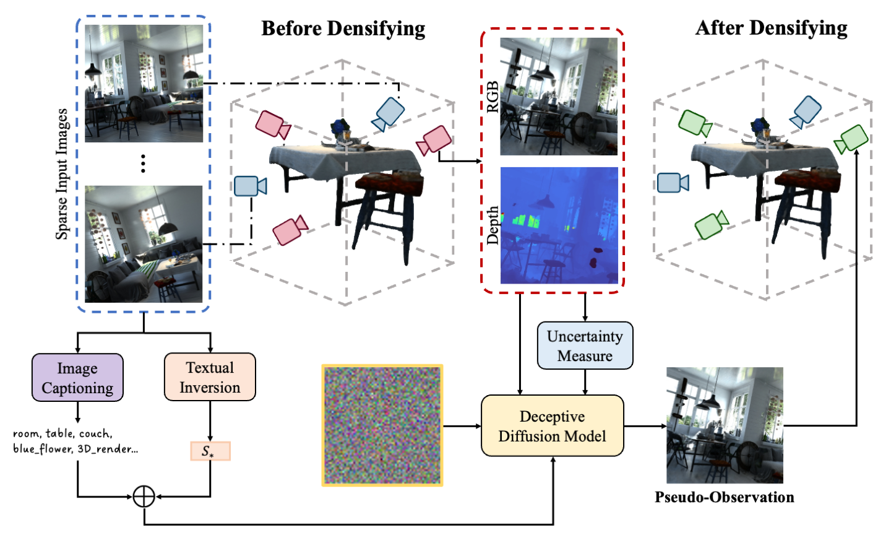

# Deceptive-NeRF (ECCV 2024)
This repository contains the implementation of the paper: "Deceptive-NeRF/3DGS: Diffusion-Generated Pseudo-Observations for High-Quality Sparse-View Reconstruction", ECCV 2024.

This repository is still under construction and will be ready soon!

<div>

</div>


## Installation
```bash
conda create -n deceptive_nerf python=3.10
conda activate deceptive_nerf
conda install pytorch torchvision pytorch-cuda=12.1 -c pytorch -c nvidia  
pip install tqdm scikit-image opencv-python configargparse lpips imageio-ffmpeg kornia lpips tensorboard
```

## Download and Process Hypersim
To use the `download_process.sh` script, provide the base directory and the index as command-line arguments. The base directory is where the Hypersim data will be downloaded and processed, and the index specifies the specific dataset.

**Command Syntax:**
```bash
./download_process.sh <base directory> <index>
```

- `<base directory>`: The path to the directory where you want the data to be downloaded and processed.
- `<index>`: The numerical index representing the specific dataset to handle.

**Example Command:**
- If you want to process data at index 5 in the directory `/home/user/hypersim_data`, run:
  ```bash
  ./download_process.sh /home/user/hypersim_data 5
  ```

**Deceptive Diffusion Model Weights:**
Coming soon!

**Progressice Training Script:**
Coming soon!

## Citation
If you find ChatCam useful in your research, please consider citing:
```
@article{liu2023deceptive,
    title={Deceptive-NeRF/3DGS: Diffusion-Generated Pseudo-Observations for High-Quality Sparse-View Reconstruction},
    author={Liu, Xinhang and Chen, Jiaben and Kao, Shiu-hong and Tai, Yu-Wing and Tang, Chi-Keung},
    journal={arXiv preprint arXiv:2305.15171},
    year={2023}
}
```